<div align="center">



<br><br>


</div>


## 🧭 Sobre mim

```yaml
nome: Guilherme Ramos
curso: Engenharia Informática — 3º ano
instituição: ESTG | Instituto Politécnico de Viana do Castelo (IPVC)
projeto_principal: AutoCare-AI (parceria com a Brilean)
foco: IA/ML · RAG · Visão Computacional · Mobile (Flutter/Kotlin)
fora_do_código: [basquetebol 🏀, gaming 🎮, animes 📺]
disponível_para: estágio/emprego em desenvolvimento de software
```


## 🛠️ Stack

<table>
<tr>
<td valign="top" width="50%">

**Mobile & Frontend**
<br>


</td>
<td valign="top" width="50%">

**Backend, Dados & IA**
<br>


</td>
</tr>
</table>

<div align="center">

`Flutter` `Dart` `Kotlin` `React` `Angular` `TypeScript` `Supabase` `PostgreSQL` `RAG / LLMs` `Python` `Java` `C#` `C++` `Git`

</div>


## 🚀 Em destaque

<table width="100%">
<tr>
<td width="50%" valign="top">

### 🚗 AutoCare-AI <sub>(privado)</sub>
Mecânico virtual em **Flutter** — gestão de documentos com OCR, pipeline **RAG** (pgvector + Supabase), chatbot multi-modo, deteção visual em tempo real com **YOLO**, integração com a **NHTSA vPIC API** e **Gemini AI**.

`Flutter` `RAG` `Supabase` `Gemini` `YOLO`

</td>
<td width="50%" valign="top">

### 🎥 NeRF Studio <sub>(brevemente público)</sub>
Pipeline de reconstrução 3D construída de raiz — **Python**, **PyTorch**, **FastAPI**, **React**, **Instant-NGP** e **COLMAP**, a correr numa RTX 3070 Ti.

`PyTorch` `FastAPI` `React` `COLMAP`

</td>
</tr>
<tr>
<td width="50%" valign="top">

### 🏆 MatchUp
App Android de gestão de torneios desportivos — frontend em **Kotlin/Compose**, backend em **Ktor**, deployado no Render com **Supabase PostgreSQL**.

`Kotlin` `Ktor` `Supabase`

**[🔗 Ver projeto](https://github.com/duartesilva18/MatchUp)**

</td>
<td width="50%" valign="top">

### 🔒 Segurança de Redes
Estudo comparativo **pfSense CE** vs **OPNsense** vs **IPFire** — VLANs, firewall rules, OpenVPN e Suricata IDS/IPS em ambiente virtualizado.

`pfSense` `OPNsense` `Suricata`

</td>
</tr>
<tr>
<td width="50%" valign="top">

### 🔗 WorkLink
_[completa aqui uma descrição curta do projeto]_

**[🔗 Ver projeto](https://github.com/Guilherme27398/WorkLink)**

</td>
<td width="50%" valign="top">

### 🎮 Super-Pixel-Quest
_[completa aqui uma descrição curta do jogo]_

**[🔗 Ver projeto](https://github.com/Guilherme27398/Super-Pixel-Quest)**

</td>
</tr>
<tr>
<td width="50%" valign="top">

### ⚔️ Hero's Ascension
_[completa aqui uma descrição curta do jogo]_

**[🔗 Ver projeto](https://github.com/Guilherme27398/Hero-s-Asencion)**

</td>
<td width="50%" valign="top">

### 📅 GoingDay
_[completa aqui uma descrição curta do projeto]_

**[🔗 Ver projeto](https://github.com/Guilherme27398/goingdayy)**

</td>
</tr>
<tr>
<td width="50%" valign="top">

### 🗓️ Gestor de Eventos (SIR)
_[completa aqui uma descrição curta do projeto]_

**[🔗 Ver projeto](https://github.com/duartesilva18/GestorEventosSIR)**

</td>
<td width="50%" valign="top">

</td>
</tr>
</table>


## 📊 Atividade

<div align="center">


<br>


</div>


<div align="center">

## 🤝 Vamos conectar

<a href="https://www.linkedin.com/in/guilherme-oliveira-8345a7394/">
  
</a>
<a href="mailto:ramosguilherme100@gmail.com">
  
</a>
<a href="https://github.com/Guilherme27398">
  
</a>

<br><br>


</div>


